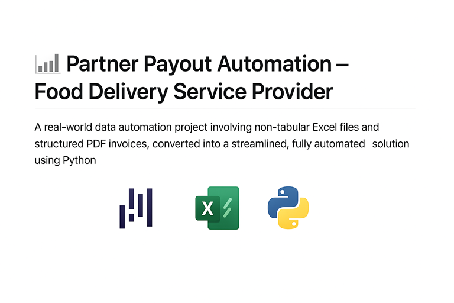

# 📊 Payout & Invoice Data Consolidation with Python

> A real-world data automation project transforming disparate, often unstructured Excel and PDF financial documents into a streamlined, fully automated solution using Python.

---

## 🚀 Project Overview

One of the restaurant partner companies receives billing and commission data from a food delivery service in various formats — mostly Excel annexures and PDF invoices. However, these files are often designed for human readability, not data analysis.

The goal was to automate the extraction of:
- Brand-level summaries
- Order-level transactions
- Sub-category payout breakdowns
- Detailed GST invoice fields

...and consolidate them into a master Excel workbook for final review and reporting.

✅ The project involved **data extraction, cleaning, enrichment, and output formatting**, all handled via custom Python scripts, significantly reducing manual effort and improving data accessibility.

----


# 📊 Payout & Invoice Data Consolidation with Python

> A real-world data automation project transforming disparate, often unstructured Excel and PDF financial documents into a streamlined, fully automated solution using Python.
---

## 🧰 Tools & Skills Used

| Category          | Tools / Libraries                      |
|------------------|-----------------------------------------|
| Data Handling     | `pandas`, `openpyxl`, `os`              |
| PDF Parsing       | `pdfplumber`, `re` (Regular Expressions)|
| File Automation   | `os`, `datetime`                       |
| Output Structuring| `ExcelWriter`                          |
| Core Skills       | Data Wrangling, Cell Referencing, PDF Text Extraction, Regex, Debugging, Version Control

---

## 📂 Understanding the Input Data & Its Challenges

This project tackled real-world financial data, including:
- Multiple Excel annexures (approx. 8 files)
- Multiple unstructured PDF invoices (approx. 6 files)
- A single output template (`consolidated_file.xlsx`) to be filled

But the raw files were **not structured for code consumption**.

---

### 🟥 Challenge 1: Summary Sheet – Non-Tabular

Each Excel file contained a `Summary` sheet with important fields like Brand, Location, and Payout — but the values were spread across merged cells and decorative formatting.

  
> *Example of summary layout — no headers or table structure*

---

### ✅ Solution:

Used `openpyxl` to extract data from fixed cell positions like `B5`, `B6`, `E13`, etc.

```python
row = {
    "Brand": ws['B5'].value,
    "Res-Id": ws['B8'].value,
    "Total Payout": ws['C14'].value
}
```

---

### 🟧 Challenge 2: Payout Breakup – Semi-Structured Blocks & Multi-File Aggregation

The `Payout Breakup` sheets were styled with manual formatting. Tables often started at specific rows, had shifted headers, and no proper index. The task also involved aggregating this data from multiple source files.

---

### ✅ Solution:

- Used Pandas `.iloc[start_row:end_row, start_col:end_col]` to skip decorative headers and extract tabular data.
- Mapped fields like Brand, Res-ID, and Payout Period using lookups.
- Created logic to loop over all Excel files and append payout breakup rows into a master DataFrame.

```python
df = pd.read_excel(file_path, sheet_name="Payout Breakup")
extracted_data = df.iloc[2:33, 1:6]

summary_data = summary_df.loc[summary_df["File Name"] == file, ["Brand", "Res-Id", "Payout Period"]].values[0]
brand, res_id, payout_period = summary_data

for _, row in extracted_data.iterrows():
    # Format and append logic here
    pass
```

---

### 🟨 Challenge 3: PDF Invoice Parsing – Unstructured Text Extraction

The PDFs contained tax invoices with fields like:
- Invoice Number, Date, GSTINs
- CGST, SGST, Reimbursements

But the layout was variable and not table-based.

---

### ✅ Solution:

- Used `pdfplumber` to extract full text from PDF.
- Applied regex to pull out invoice number, date, total, and line items.
- Structured the results for final Excel tab population.

```python
text = pdfplumber.open(pdf_path).pages[0].extract_text()

invoice_date_raw = extract_value(r"Invoice Date\s*:\s*(.+)", text)
invoice_number = extract_value(r"Invoice Number\s*:\s*(\w+)", text)
grand_total = extract_value(r"Grand Total\s*([\d.,]+)", text)

item_lines = re.findall(r"(\d+)\s+([^
]+?)\s+996211\s+OTH\s+1\s+([\d.,]+).*?([\d.,]+)", text)
```

---

## ✅ Final Outcome

The project successfully delivered a fully automated Excel output, `consolidated_file.xlsx`, containing four organized tabs:

| Tab Name            | Content Extracted From                                                   |
|---------------------|--------------------------------------------------------------------------|
| Summary             | Key static fields from Excel summary sheets                              |
| Payout Breakup Tab  | Commission, packaging, and discount splits from payout sheets            |
| Order Level         | Row-level order transactions aggregated from Excel files                 |
| Commission Invoice  | Invoice fields (GSTINs, taxes, totals) parsed from PDF files             |

📸 

---

## 🎓 What I Learned

This project was a deep dive into practical data automation — about understanding diverse structures, spotting patterns, and designing adaptable logic.

### Key Takeaways:

- 📄 Extracted data from stylized Excel files using smart cell referencing.
- 📜 Parsed unstructured PDF text using regex for reliable data capture.
- 🔁 Iterated through multiple development versions (e.g. 7 for Task 2).
- 🔄 Built reusable and scalable automation logic for future billing cycles.
- 🧠 Strengthened Python skills with Pandas, PDF parsing, and robust file management.

---

## 📬 Contact

**Aman – Data Analyst**  
📧 [amanbana01@gmail.com]  
🔗 [LinkedIn](https://www.linkedin.com/in/aman-bana-204a4a136/) • [Portfolio](https://amanbana.github.io/Iamanlyst.github.io/)

---

> *"Structure is more powerful than content — and when you have both, you win."*
